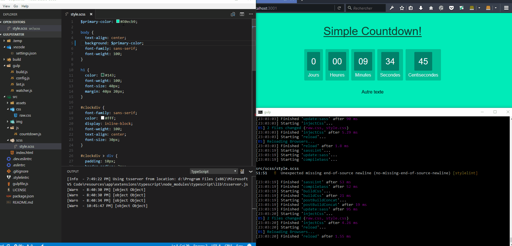

# Static Site Gulp Starter Pack

Simple template for static web site using the task-runner gulp (with focus on good pratices). Uses lots of sweet 
gulp-pluggin to make the development easier.

Why static? Because you can easily deploy it on github-pages!




## How to use

This project allow to use every command in different env mode. Currently two mode in available
* development: optimize (minimize, concat, uglify,...) files
* production: leave them mostly untouched (easier debugging)

You can set the environnement by adding the arguments at the end of a gulp command, by exemple: 

```sh
--env=production
```
(by default it is development)


#### You have npm script:

* build: build the project to be production ready
```sh
npm run build
```

* deploy: build and deploy the project on gh-pages (the branch must exist)
```sh
npm run deploy
```

#### You have gulp script:

* server: setup a live-reaload environnement
```sh
gulp server
```

* lint: check if your files follow the defined standards
```sh
gulp lint
```


## How to "install"

Download the template in the repository you want to create your web application.

Install the depedencies

```sh
npm install
```

## Integrated gulp-plugins

Build plugins
* [Sass](https://github.com/dlmanning/gulp-sass): support Sass 
* [Uglify](https://github.com/terinjokes/gulp-uglify): minify javascript
* [Cssnano](https://github.com/ben-eb/gulp-cssnano): minify css 
* [Autoprefixer](https://github.com/sindresorhus/gulp-autoprefixer): Add vendor prefix for you (in css)
* [Imagemin](https://github.com/sindresorhus/gulp-imagemin): minify image
* [Useref](https://github.com/jonkemp/gulp-useref): Allow files concatenation


Utils plugins: 
* [browser-sync](https://www.browsersync.io/docs/gulp) : Allo auto live-reload  

Linting plugins:
* [eslint](https://github.com/adametry/gulp-eslint) : linter for javascript
* [stylelint](https://github.com/stylelint/stylelint) : linter for style sheet (css and scss)
* [stylefmt](https://github.com/morishitter/stylefmt) : auto-format style sheet (may be removed: could be move to IDE)


## What next

* Avoid piping non newer files
* Add templating system
* Add testing


# Require some setup on wercker

1. Add steps in workflow
2. Add the $GIT_TOKEN